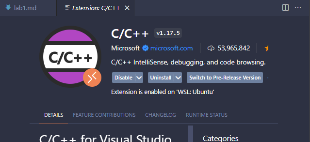

# OS & Architectures labs

> Last updated on 8th October 2024

This repo contains a rewritten version of the CSC398/CSCM98 lab tasks which should work on any Windows, macOS, or Linux computer.

Specifically, the lab code has been rewritten to use the `gcc` compiler instead of the `msvc` compiler (which only works on Windows).

## Getting started

> [!IMPORTANT]
>
> **It's recommended to use your own computer to complete the lab tasks** — rather than the University lab PCs — since the lab PCs often don't have the correct software installed.
>
> This repo therefore assumes you will be completing the lab tasks on your own computer.

To get started:

1. **Use the [setup guide](#setting-up-your-computer-for-c) below to setup your own computer for C++ development.**
2. Once your computer is setup, you can start the lab tasks as detailed in the [lab task overview](#lab-task-overview) below

## Lab task overview

- [Lab 1](./lab1) is an introduction to multithreading in C++.
- [Lab 2](./lab2) is about race conditions, and how to share data properly when working with concurrency.
- [Lab 3](./lab3) is about applying our knowledge so far to fix an example money-passing game.
- ~~[Lab 4](./lab4) is not yet implemented.~~
- [Lab 5](./lab5) is about using processor-level SIMD instructions to improve performance.

## Setting up your computer for C++

In order to run the code in this repo, you need to make sure your computer has the right software installed. You will need:

- [Visual Studio Code](https://code.visualstudio.com/download) (a.k.a. vscode) – an editor for writing code
  - plus the ['C/C++ Extension Pack'](https://marketplace.visualstudio.com/items?itemName=ms-vscode.cpptools-extension-pack)
- `gcc` – a C++ compiler
- `gdb` – a C++ debugger (or `lldb` if using macOS)

> [!NOTE]
>
> If you know what you're doing then you can use a different IDE, but the lab demonstrators will be most familiar with vscode.

### Install vscode

1. [Download vscode from the Visual Studio website](https://code.visualstudio.com/download) and install it.
2. Open it up and you should see something like this:

   

3. Next, you need to install the C++ extension so that vscode works nicely with the lab code.

   To do this, open up the **'Extensions'** panel on the left-hand side of the window (the icon looks like a square with four squares inside it) and search for **'c++ pack'**:

   

4. Click on **'C/C++ Extension Pack'**, then click **'Install'**. It should now look something like this:

   

### Install gcc and gdb

As mentioned, you will be using the `gcc` compiler and `gdb` debugger. These are both part of the GNU Compiler Collection, which is a big collection of tools for compiling and debugging code. This means you only need to download and install one thing, which is handy.

How you do this is going to depend on what operating system your computer has (either Windows, macOS, or Linux). **Figure this out now!**. If you're not sure, ask one of the lab demonstrators.

Now, follow the guide below which corresponds to your operating system:

<details>
<summary>Installing gcc/gdb on Windows (click to read instructions)</summary>

> [!IMPORTANT]
>
> **It is highly recommended that you simply use Windows Subsystem for Linux (WSL) rather than installing MSYS2!**
>
> - **If you know what WSL is and already have it set up**, follow the ['_Windows: Use WSL in vscode_' instructions](#windows-use-wsl-in-vscode) below
>
> - Otherwise, if you don't know what WSL is, then follow the ['_Windows: Install MSYS2_' instructions](#windows-install-msys2) below

#### Windows: Use WSL in vscode

This assumes you have WSL already setup and ready to go ([Microsoft guide to installing WSL](https://learn.microsoft.com/en-us/windows/wsl/setup/environment)):

1. Open vscode and [download the 'WSL' vscode extension](https://marketplace.visualstudio.com/items?itemName=ms-vscode-remote.remote-wsl)
1. Click the 'remotes' button in the very bottom-left corner of the window. In the prompt that appears, click '_Connect to WSL_':

   

1. The window will refresh, then you should see something like '_WSL: Ubuntu_' in the bottom-left corner of the window:
   

1. You should now have access to `gcc` and `gdb` because you're now running vscode within a Linux environment.

   You can test that it's all working by opening a terminal within vscode by clicking '**Terminal' > 'New Terminal**' in the top toolbar:

   

   Then type `gcc --version` to check that `gcc` is ready to use. You should see something like:

   ```bash
   matt@MattTop22:/mnt/c/Users/mhmat/Repos/cscm98-labs$ gcc --version

   gcc (Ubuntu 11.4.0-1ubuntu1~22.04) 11.4.0
   Copyright (C) 2021 Free Software Foundation, Inc.
   This is free software; see the source for copying conditions.  There is NO
   warranty; not even for MERCHANTABILITY or FITNESS FOR A PARTICULAR PURPOSE.
   ```

1. That's it! You can skip the MSYS2 installation step and go straight to [downloading the lab files](#download-the-lab-files).

#### Windows: Install MSYS2

> [!NOTE]
> Skip this step if you have WSL setup and working in vscode

We're going to install MSYS2, which is basically a big collection of handy tools which Windows doesn't come with. The installation process is a big fiddly, but it's the easiest way to get everything working on Windows.

To install MSYS2, follow these steps:

1. [Download MSYS2](https://www.msys2.org/) and follow its installation instructions.
2. Open **'MSYS2 MinGW 64-bit'** from the start menu.
3. Type `pacman -S --needed base-devel mingw-w64-ucrt-x86_64-toolchain` in the terminal and press Enter.
4. Press Enter when it asks: **'Enter a selection (default=all):**' to accept the installation.
5. Type `y` when prompted to confirm the installation, then let it download and install.
6. Open the start menu, type `environment`, and click '**Edit environment variables for your account**'.
7. In the top **'User variables'** box, click on '**Path**' and click '**Edit...**'.
8. Click '**New**', type `C:\msys64\ucrt64\bin` and press Enter to add it to the list.
9. Click '**OK**' on all the windows to close them.

To check it installed correctly:

1. Open vscode, then open up a new terminal by clicking '**Terminal' > 'New Terminal**' in the top toolbar:

   

2. Type `gcc --version` and press Enter. You should see something like this:

   ```powershell
   PS C:\Users\mhmat\Repos\cscm98-labs> gcc --version

   gcc.exe (Rev7, Built by MSYS2 project) 13.1.0
   Copyright (C) 2023 Free Software Foundation, Inc.
   This is free software; see the source for copying conditions.  There is NO
   warranty; not even for MERCHANTABILITY or FITNESS FOR A PARTICULAR PURPOSE.
   ```

</details>

<details>
<summary>Installing gcc/lldb on macOS (click to read instructions)</summary>

#### macOS

If you're using macOS, then you'll need to install the Xcode Command Line Tools. To do this, open up Terminal and type:

```zsh
xcode-select --install
```

This will open up a window asking if you want to install the tools. Click **'Install'** and follow the instructions.

Once it's done, check if everything installed correctly by opening Terminal again and typing:

```zsh
xcode-select -p
```

This should output something like:

```zsh
/Library/Developer/CommandLineTools
```

Check that `gcc` installed correctly by typing:

```zsh
gcc --version
```

This should output something like:

```zsh
Apple clang version 15.0.0 (clang-1500.0.40.1)
Target: arm64-apple-darwin22.6.0
Thread model: posix
InstalledDir: /Library/Developer/CommandLineTools/usr/bin
```

Finally, check that `lldb` installed correctly by typing:

```zsh
lldb --version
```

This should output something like:

```zsh
lldb-1500.0.22.8
Apple Swift version 5.9 (swiftlang-5.9.0.128.108 clang-1500.0.40.1)
```

</details>

<details>
<summary>Installing gcc/gdb on Linux (click to read instructions)</summary>

#### Linux

If you're using Linux, then you should already have `gcc` and `gdb` installed. To check, open a terminal and type:

```bash
gcc --version

g++ --version

gdb --version
```

Each of these should print out the version of the tool, like this:

```bash
$ gcc --version

gcc (Ubuntu 11.4.0-1ubuntu1~22.04) 11.4.0
Copyright (C) 2021 Free Software Foundation, Inc.
This is free software; see the source for copying conditions.  There is NO
warranty; not even for MERCHANTABILITY or FITNESS FOR A PARTICULAR PURPOSE.
```

If not, use your distro's package manager to install them. For example, on Ubuntu you can install using `apt` as follows:

```bash
sudo apt install build-essential gdb
```

</details>

## Download the lab files

Your computer should now be configured to run the lab tasks. Now, you just need to download the lab class files and open them in vscode.

1. If you haven't already, download this GitHub repo ([link to repo](https://github.com/mhmatthall/cscm98)) by clicking the green **'Code'** button on the main page, like this:

   

   You can either **'Download ZIP'** or clone the repo to your computer.

   > [!WARNING]
   > If you download the repo as a ZIP file, **make sure you extract the contents** before you go any further. You will face issues if you don't extract the files from the ZIP.

2. Open vscode, then open up the folder which contains the (extracted!) code you just downloaded. You can do this by clicking **'File' > 'Open Folder'** and selecting the relevant folder.

   You should now see the folder open in vscode, like this:

   

3. That's it! You're now ready to get started with the lab tasks. See the [lab task overview](#lab-task-overview) at the top of this file to get started.
