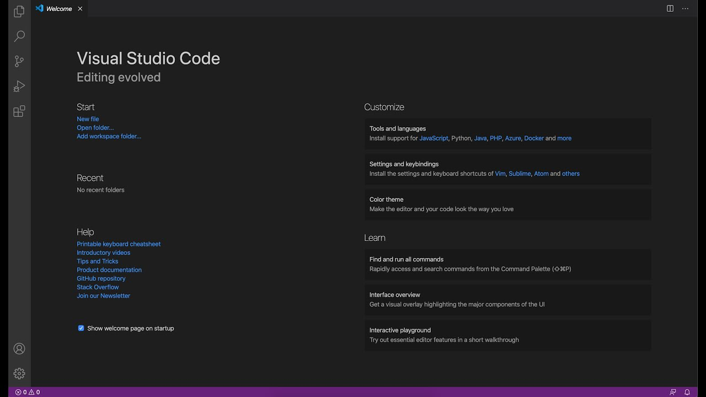
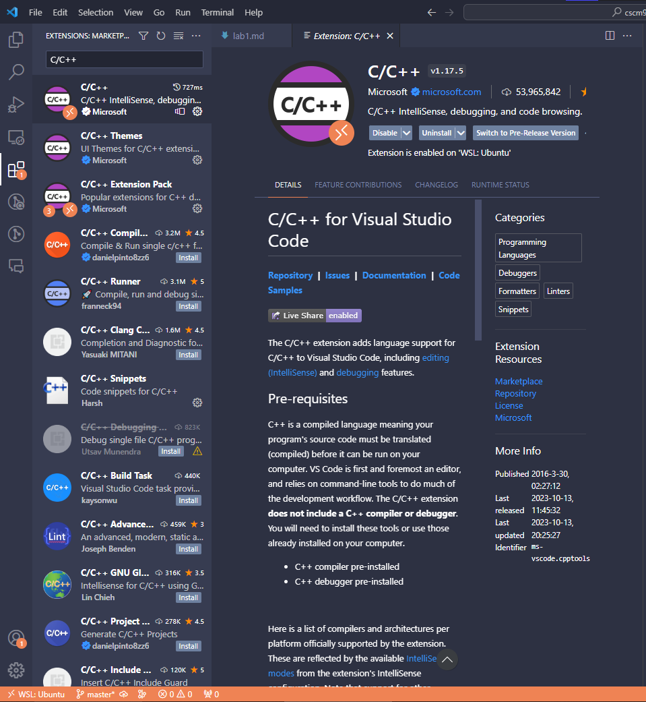
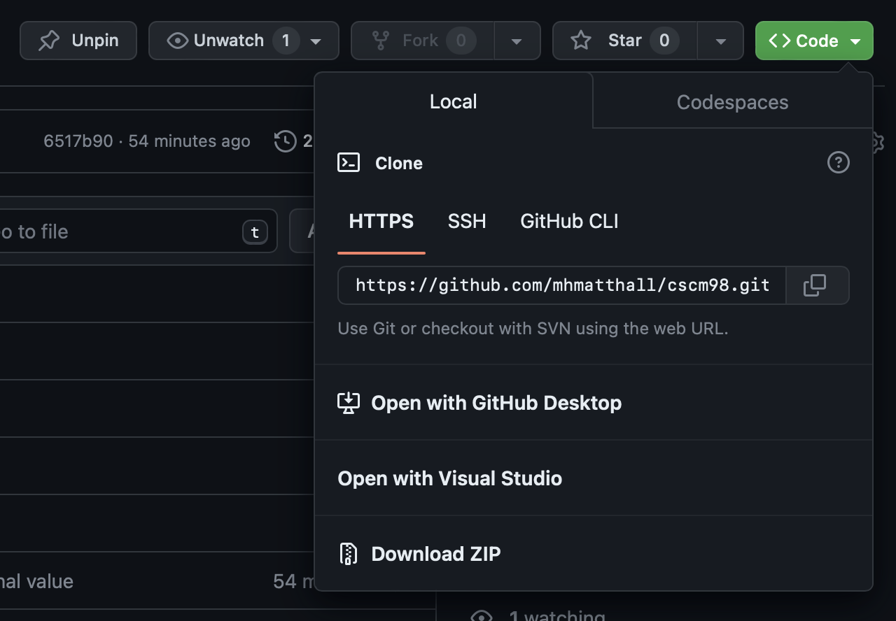
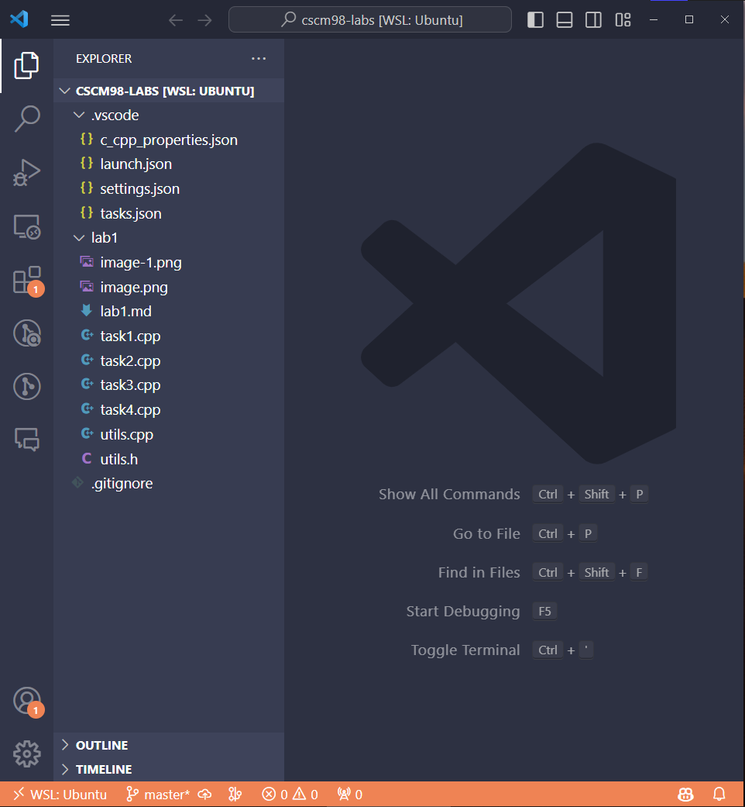
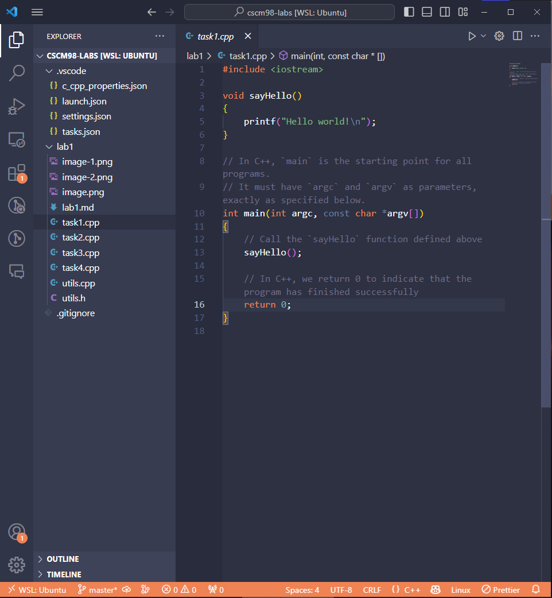
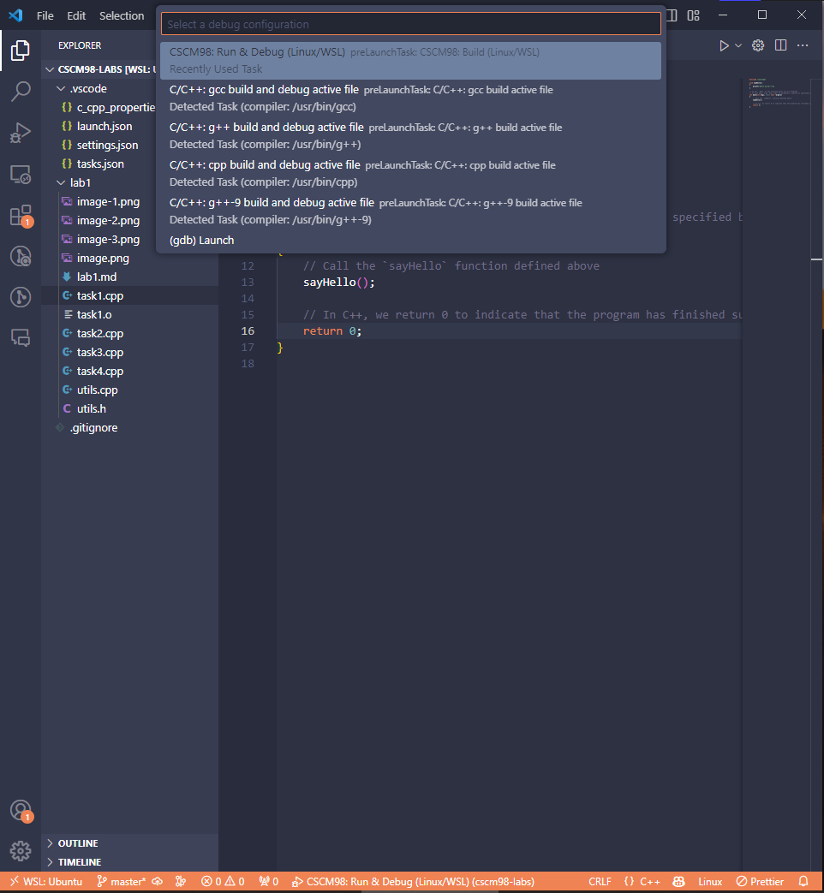
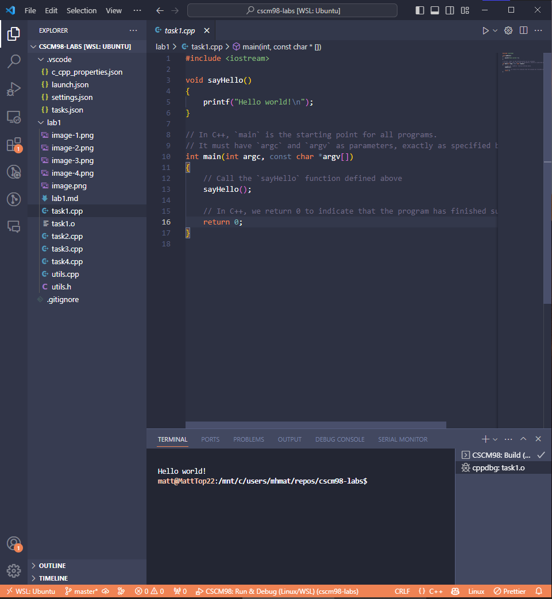

# OS & Architectures: Lab 1

*Last updated on 9th November 2023*

## Overview
In this lab, you'll set up your computer to work with the lab tasks and get familiar with the basics of C++, which is the programming language you'll be using for these labs. You'll learn the basics of multithreading in C++ and how you can speed up programs by splitting up the work between processor threads.

## Setup
Before we can run any of the code in this lab, we need to make sure our computer has the right software installed.

We will need:
- Visual Studio Code (vscode) – an editor for writing code
- `gcc` – a C++ compiler
- `gdb` – a C++ debugger (or `lldb` if using macOS)

> If you know what you're doing, you can use a different IDE, but the lab demonstrators will only be able to help with vscode.

### Installing vscode
Simply download the correct installer from [the vscode website](https://code.visualstudio.com/download) and install it. Open it up and you should see something like this:


In order for vscode to work nicely with C++ code, we will need to install the relevant extension. To do this, open up the **'Extensions'** panel on the left-hand side of the window (the icon looks like a square with four squares inside it) and search for **'C/C++'**. Click on the extension and click **'Install'**.

It should now look something like this:


### Installing gcc and gdb
As mentioned, we will be using the `gcc` compiler and `gdb` debugger. These are both part of the GNU Compiler Collection, which is a big collection of tools for compiling and debugging code. This means we only need to download and install one thing, which is handy.

How we do this is going to depend on what operating system your computer has. **Figure this out now!** You will have either Windows, macOS, or Linux. If you're not sure, ask one of the lab demonstrators.

#### Windows
>*If you know what Windows Subsystem for Linux (WSL) is and already have it set up, then download [the 'WSL' vscode extension](https://marketplace.visualstudio.com/items?itemName=ms-vscode-remote.remote-wsl) and connect to WSL after opening the project folder. This should just let you use `gcc` and `gdb` without the need to install MSYS2 — run `gcc --version` in the vscode WSL terminal to check. If `gcc` doesn't work, then follow the Linux instructions in this guide to install it in your WSL environment.*

We're going to install MSYS2, which contains what we need along with lots of other tools that we won't be using. This is a bit of a pain, but it's the easiest way to get everything working on Windows.

To get started, follow these steps:

1. [Download MSYS2](https://www.msys2.org/) and install it
2. Open **'MSYS2 MinGW 64-bit'** from the start menu
3. Type `pacman -S --needed base-devel mingw-w64-ucrt-x86_64-toolchain` in the terminal and press Enter
4. Press Enter when it asks: **'Enter a selection (default=all):**' to accept the installation
5. Type `y` when prompted to confirm the installation, then let it download and install
6. Open the start menu, type `environment`, and click '**Edit environment variables for your account**'
7. In the top **'User variables'** box, click on '**Path**' and click '**Edit...**'
8. Click '**New**', type `C:\msys64\ucrt64\bin` and press Enter to add it to the list
9. Click '**OK**' on all the windows to close them

To check it installed correctly, open up a new terminal in vscode by clicking '**Terminal' > 'New Terminal**' in the top toolbar. Type `gcc --version` and press Enter. You should see something like this:
```
gcc.exe (Rev7, Built by MSYS2 project) 13.1.0
Copyright (C) 2023 Free Software Foundation, Inc.
```

#### macOS
If you're using macOS, then you'll need to install the Xcode Command Line Tools. To do this, open up Terminal and type:
```
xcode-select --install
```

This will open up a window asking if you want to install the tools. Click **'Install'** and follow the instructions.

Once it's done, we can check if everything installed correctly by opening Terminal again and typing:
```
xcode-select -p
```
This should output something like:
```
/Library/Developer/CommandLineTools
```
Check that `gcc` installed correctly by typing:
```
gcc --version
```
This should output something like:
```
Apple clang version 15.0.0 (clang-1500.0.40.1)
Target: arm64-apple-darwin22.6.0
Thread model: posix
InstalledDir: /Library/Developer/CommandLineTools/usr/bin
```

Finally, check that `lldb` installed correctly by typing:
```
lldb --version
```
This should output something like:
```
lldb-1500.0.22.8
Apple Swift version 5.9 (swiftlang-5.9.0.128.108 clang-1500.0.40.1)
```

#### Linux
If you're using Linux, then you should already have `gcc` and `gdb` installed. To check, open a terminal and type:
```
gcc --version

g++ --version

gdb --version
```

Each of these should print out the version of the tool, like this:
```
gcc (Ubuntu 9.4.0-1ubuntu1~20.04.1) 9.4.0
Copyright (C) 2019 Free Software Foundation, Inc.
```

If not, use your distro's package manager to install them. For example, on Ubuntu you can install using `apt` as follows:
```
sudo apt install build-essential gdb
```

## Task 0: Opening the lab files
Your computer should now be configured to run the lab tasks, so let's test it out.

### Downloading the lab tasks
1. If you haven't already, download this GitHub repo by clicking the green **'Code'** button on the main page, like this:

    

    You can either **'Download ZIP'** or clone the repo to your computer. **If you download the repo as a ZIP file, make sure you extract the contents before you go any further.**

1. Open vscode, then open up the folder which contains the code you just downloaded. You can do this by clicking **'File' > 'Open Folder'** and selecting the relevant folder.
   
    You should see something like this:
    

## Task 1: Hello World!
With everything downloaded, we can now try and run the code. All the files we'll be working with in this lab are in the '`lab1`' folder - you can ignore the '`.vscode`' folder, that's all just config files for vscode.

1. Click on the `task1.cpp` file to open it.

    You should see something like this:
    

    This code is a simple program that makes the computer say **'Hello world!'** back to us.
   
1. Click the play button in the top-right of the window to run the code.
   
    A box should appear to ask which 'debug configuration' to use, like this:
    

1. Select '**CSCM98: Run & Debug (gcc)**' and vscode should compile and run the code.
   
    You should see the terminal appear at the bottom displaying the words **'Hello world!'**, like this:
    

    If the terminal didn't appear, click '**View' > 'Terminal**' in the top toolbar, or press `Ctrl+'`/ `Cmd+'`.

    If you don't see the words **'Hello world!'** or you get any errors, then ask one of the lab demonstrators to have a look.

## Task 2: Introduction to threads in C++
Open up [`task2.cpp`](./task2.cpp). In this task, you are shown the basics of how to use threads in C++.

## Task 3: Why we use multithreading
Open up [`task3.cpp`](./task3.cpp). In this task, you are shown a demonstration of how multithreading can significantly speed up long computations.

## Task 4: Real-world example
Open up [`task4.cpp`](./task4.cpp). In this task, you are shown a demonstration of multithreading used in a real-world example of estimating pi using the [Leibniz formula](https://en.wikipedia.org/wiki/Leibniz_formula_for_π).
