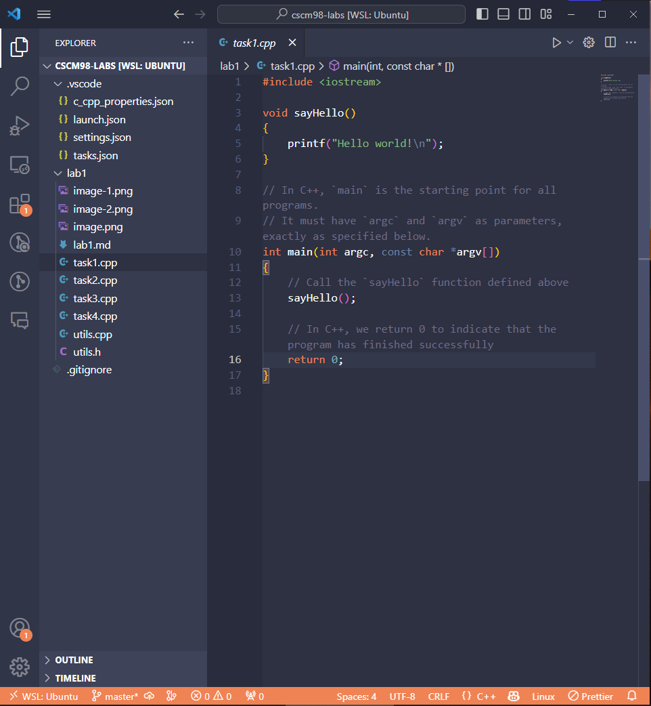
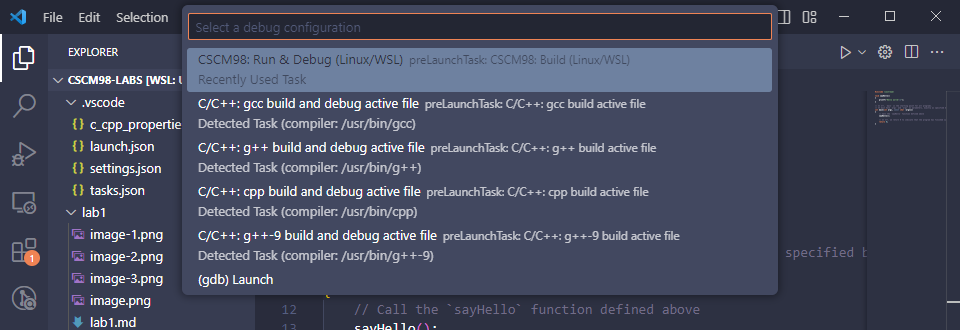
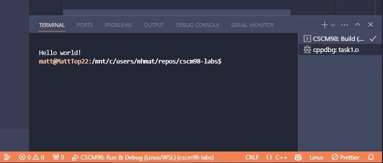

# OS & Architectures: Lab 1

> Last updated on 8th October 2024

## Overview

In this lab, you will:

- Learn the basics of C++, which is the programming language used in this module.
- Learn the basics of multithreading in C++, and how you can speed up programs by splitting up the work between processor threads.

### Contents

- [Task 1: Hello World!](#task-1-hello-world)
- [Task 2: Introduction to threads in C++](#task-2-introduction-to-threads-in-c)
- [Task 3: Why we use multithreading](#task-3-why-we-use-multithreading)
- [Task 4: Real-world example](#task-4-real-world-example)

## Task 1: Hello World!

1. Open the file: `/lab1/task1.cpp`. You should see something like this:

   

   This code is a simple program that makes the computer say **'Hello world!'** back to us.

2. Click the play button in the top-right of the window to run the code.

   A box should appear to ask which 'debug configuration' to use, like this:

   

3. Select '**CSCM98: Run & Debug (gcc)**' and vscode should compile and run the code.

   You should see the terminal appear at the bottom displaying the words **'Hello world!'**, like this:

   

   If the terminal didn't appear, click '**View' > 'Terminal**' in the top toolbar, or press `Ctrl+'`/ `Cmd+'`.

   If you don't see the words **'Hello world!'** or you get any errors, then ask one of the lab demonstrators to have a look.

4. That's it for Task 1! You've successfully run your first C++ program.

## Task 2: Introduction to threads in C++

Open up [`task2.cpp`](./task2.cpp). In this task, you are shown the basics of how to use threads in C++.

## Task 3: Why we use multithreading

Open up [`task3.cpp`](./task3.cpp). In this task, you are shown a demonstration of how multithreading can significantly speed up long computations.

## Task 4: Real-world example

Open up [`task4.cpp`](./task4.cpp). In this task, you are shown a demonstration of multithreading used in a real-world example of estimating pi using the [Leibniz formula](https://en.wikipedia.org/wiki/Leibniz_formula_for_π).
